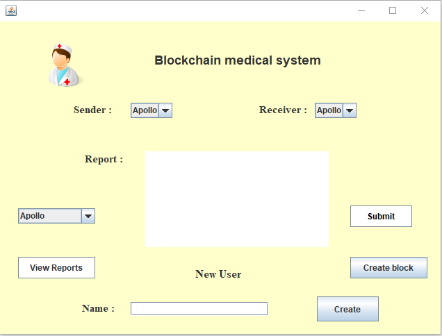

# Blockchain-medical-system

## Installation Instructions :-

1. Extract everything to same folder.
2. All the java and jar files have to be in the same folder.
3. To compile -
    * **For Linux**  
      javac -cp ".:gson-2.6.2.jar:bcprov-jdk15to18-165.jar" Gui.java
    * **For Windows**  
    javac -cp ".;gson-2.6.2.jar;bcprov-jdk15to18-165.jar" Gui.java
4. To Run -
    * **For linux**  
      java -cp ".:gson-2.6.2.jar:bcprov-jdk15to18-165.jar" Gui
    * **For Windows**  
      java -cp ".;gson-2.6.2.jar;bcprov-jdk15to18-165.jar" Gui  
  
A Gui window will open

## Screenshots of project :-

* **Gui window when the code is run**

* **Gui window after clicking view report button**

## How does the project Work :-

**StringUtil**  
We have defined StringUtil Class for utility functions related to strings , and to make signatures for every
Transaction.
We are using ECDSA signatures for this which is provided by BouncyCastleProvider which is in bcprovjdk15to18-
165.jar.
It alse verifies public key and private key pairs of ecdsa signatures and also signs them.
Other simple helper functions are also there.

**Block**  
Block Contains two Important functions:
* CalcHash: It applies SHA256 defines in StringUtil class to the data
* MineBlock: It mines the block according to some difficulty value. Basically it keeps changing the nonce until it has some number of zeroes as a prefix to the hash.  
  The number of zeroes is the difficulty value.

**Transaction**  
Transaction class holds all the details related to a Transaction in the Blockchain.
Basically the sender's and receiver public key, signature, data etc.

**Wallet**  
Wallet class is basically what the user is. It contains public and private key of the user.
It has an Important method called sendData
This method returns a new Transaction Taking in public key of sender and receiver and data as input.
I t also implements a zero knowledge proof with the help of the function verifyid().

**Blockchain**  
This class is the most Important class and most of the work is done here.
The constructor calls the method createGenesisBlock which when initializing creates the genesis block
It has an attribute called undoneTransaction which is an arraylist of Transactions and holds the new Transactions which arent in any block yet
After a certain number of new Transactions a new block is created , the blockchain holds all the blocks in an arraylist.
It has methods like :
* **VerifyTransactions** : This method verifies all the Transactions in the undoneTransaction arraylist using ECDSA signature verification.
* **CreateBlock** : This method creates a new block , puts all the undoneTransaction in it and mines the new block. It creates new block only after Verifying Transactions.
  After that it puts the new block in the chain arraylist and empties undoneTransaction arraylist.
* **ViewUser** : This method shows all the Transactions of a user sent or received. Basically it loops through all the blocks and all the Transactions in them
  and prints those whose publickey matches the user.

**Gui**  
This class is responsible for the gui.It provides an interface to perform following functions:-
1. **Send reports** : it has 2 drop downs to select sender and receiver and "submit" button to send the report.The report can be typed into the given text area.
2. **Create new user** : a new user can be created by typing in his name in the given textfield.Click "create" button to create the new user.
3. **View report** : all the sent and received reports of a user can be viewed by selecting the user from dropdown and clicking the "view report" button.  
   The reports are also stored into a text file.The text file is created when we click "view report" button.
4. **Create block** : a new block is added to the blockchain after 3 transactions(reports) are made. But a new block can be added with less than 3 report by  
   clicking the "create block" button.
Gui window when the code is run.
Gui window after clicking view report button

**Data**  
Data class writes the whole blockchain into a json file.So that the blockchain can referred for future use.

## Functions and their classes :-
* MineBlock: Block Class
* VerifyTransactions : Blockchain Class
* CreateBlock : Blockchain Class.
* ViewUser : Blockchain Class
